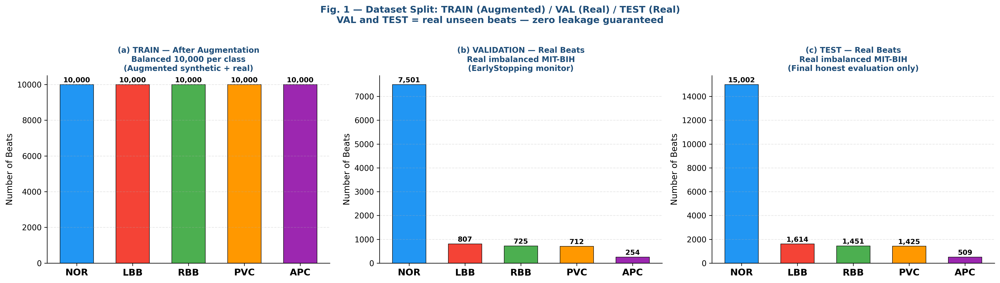
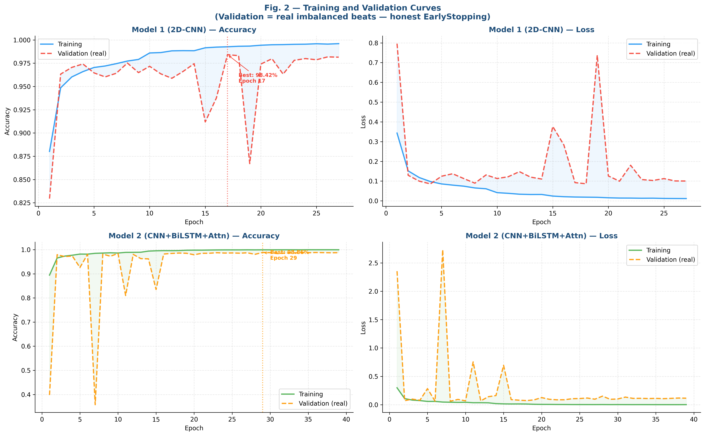
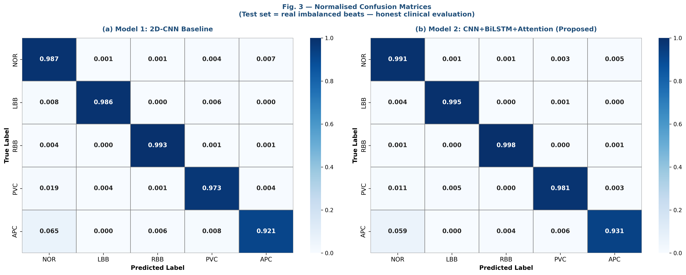
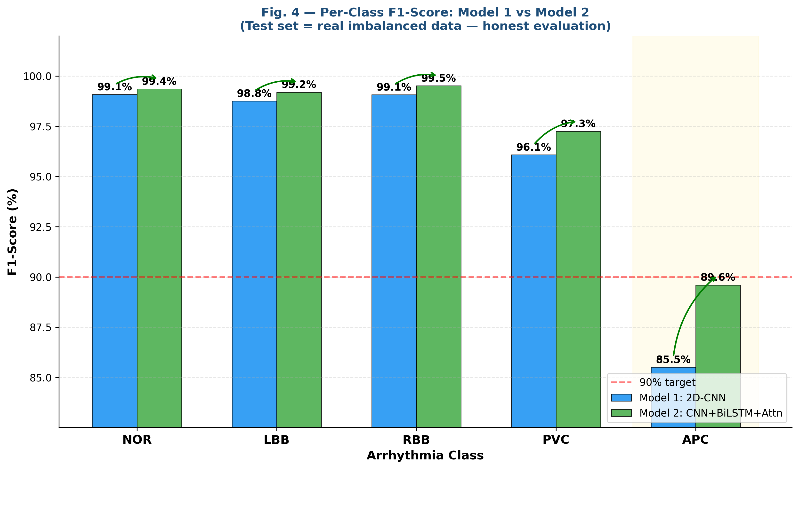
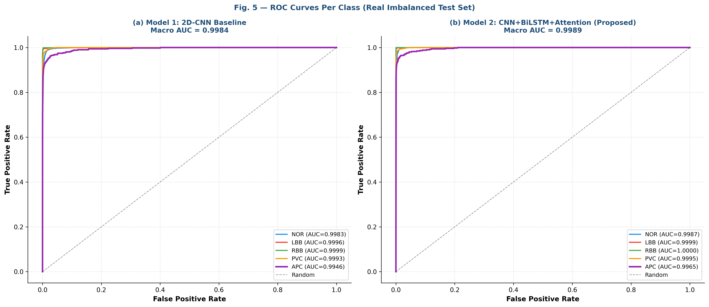
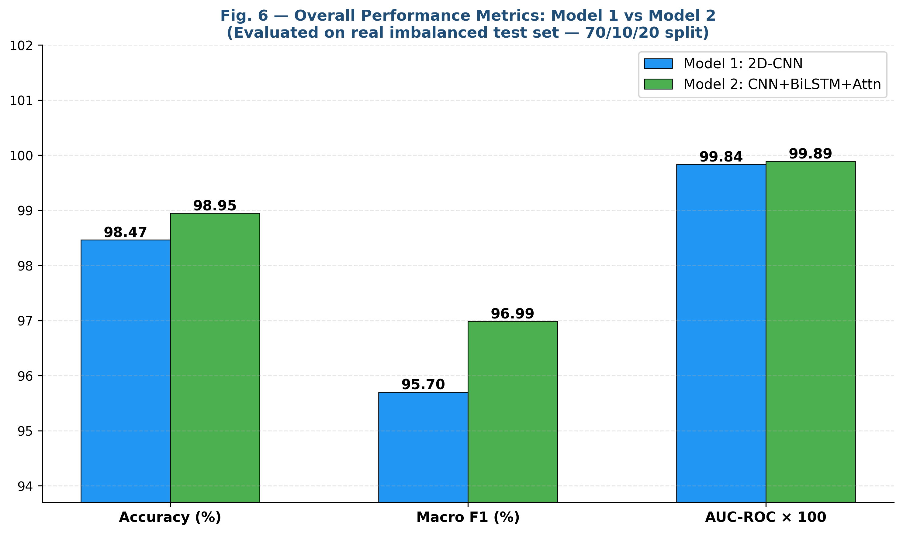
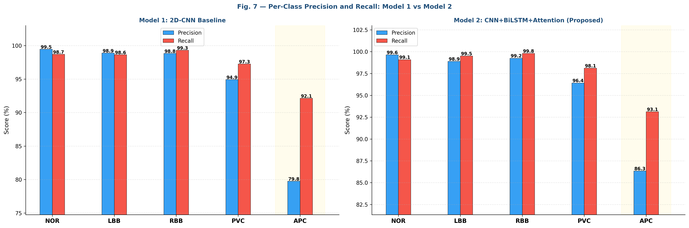
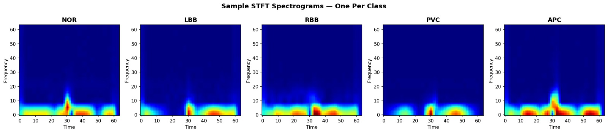

# 🫀 ECG Arrhythmia Classification — CNN+BiLSTM+Attention vs 2D-CNN Baseline

[](https://www.python.org/)
[](https://www.tensorflow.org/)
[](https://physionet.org/content/mitdb/1.0.0/)
[](LICENSE)
[]()
[]()

> **Automatic ECG arrhythmia classification using STFT spectrograms with a novel CNN+BiLSTM+Attention architecture — benchmarked against a 2D-CNN baseline on the full MIT-BIH database (all 48 records, 5 classes, real imbalanced test set).**

---

## 📋 Table of Contents

- [Overview](#-overview)
- [Results at a Glance](#-results-at-a-glance)
- [Dataset](#-dataset)
- [Architecture](#-architecture)
- [Pipeline](#-pipeline)
- [Key Figures](#-key-figures)
- [Installation](#-installation)
- [Usage](#-usage)
- [Project Structure](#-project-structure)
- [Methodology](#-methodology)
- [Comparison with Literature](#-comparison-with-literature)
- [Citation](#-citation)
- [License](#-license)

---

## 🔍 Overview

This repository contains the full training and evaluation pipeline for a deep learning system that classifies ECG beats into 5 arrhythmia categories. The core contribution is a **CNN+BiLSTM+Attention** model that combines:

- **Spatial feature extraction** via 2D convolution on STFT spectrograms
- **Temporal modelling** via Bidirectional LSTM
- **Learnable attention** to focus on the most discriminative beat regions

This is benchmarked against a lightweight **2D-CNN baseline** under an identical, rigorous evaluation protocol.

**Key design principles:**
- Training uses **augmented balanced data** (50,000 beats); validation and test use **real imbalanced data only** — zero leakage guaranteed
- EarlyStopping monitors the real validation set; the test set is completely held out until final evaluation
- Explicit class weighting handles the severe natural imbalance (NOR: 75,011 vs APC: 2,546 beats)

> ⚠️ **Data files** (`X_train.npy`, `X_val.npy`, `X_test.npy` etc.) are **not included** in this repository due to their large size. See the [Dataset](#-dataset) section for how to obtain and prepare them.

---

## 📊 Results at a Glance

Evaluated on the **real imbalanced test set** (20% hold-out, MIT-BIH all 48 records):

| Metric | Model 1: 2D-CNN | Model 2: CNN+BiLSTM+Attn |
|---|:---:|:---:|
| **Overall Accuracy** | 98.47% | **98.95%** |
| **Macro F1-Score** | 95.70% | **96.99%** |
| **AUC-ROC (macro)** | 0.9984 | **0.9989** |
| NOR F1 | 99.1% | **99.4%** |
| LBB F1 | 98.8% | **99.2%** |
| RBB F1 | 99.1% | **99.5%** |
| PVC F1 | 96.1% | **97.3%** |
| **APC F1 ⭐** | 85.5% | **89.6%** |

> ⭐ **APC (Atrial Premature Contraction)** is the minority class (only 2.55% of real beats) and the most clinically critical. Our proposed model significantly closes the performance gap.

---

## 🗃️ Dataset

**Source:** [MIT-BIH Arrhythmia Database](https://physionet.org/content/mitdb/1.0.0/) — all 48 records (PhysioNet, free access)

**5 Classes:**

| Label | Class | Raw Count | % of Total |
|---|---|:---:|:---:|
| NOR | Normal Sinus Rhythm | 75,011 | 74.9% |
| LBB | Left Bundle Branch Block | 8,071 | 8.1% |
| RBB | Right Bundle Branch Block | 7,255 | 7.2% |
| PVC | Premature Ventricular Contraction | 7,129 | 7.1% |
| APC | Atrial Premature Contraction | 2,546 | 2.5% |

**Data Split (70 / 10 / 20):**

| Split | Beats | Type | Purpose |
|---|:---:|---|---|
| Train | 50,000 | Augmented + balanced (10k/class) | Model learning |
| Validation | ~10,053 | Real imbalanced | EarlyStopping / ReduceLR |
| Test | ~20,001 | Real imbalanced | Final honest evaluation only |

### 📥 How to Get the Data

The `.npy` data files are **not tracked in this repo** due to their large file size. To reproduce the data:

1. Download the MIT-BIH Arrhythmia Database from [PhysioNet](https://physionet.org/content/mitdb/1.0.0/)
2. Segment beats and generate 64×64 STFT spectrograms (preprocessing script)
3. Run `data_splitting.py` to produce the required split files:

```bash
python data_splitting.py
# Outputs: X_train.npy, y_train.npy, X_val.npy, y_val.npy, X_test.npy, y_test.npy
```

Then place all 6 files inside a folder and point `data_dir` in the CONFIG to it.

---

## 🧠 Architecture

### Model 1 — 2D-CNN Baseline

```
Input (64×64×1)
  → Conv2D(8, 4×4, ReLU)  → BatchNorm → MaxPool
  → Conv2D(13, 2×2, ReLU) → BatchNorm → MaxPool
  → Conv2D(13, 2×2, ReLU) → BatchNorm → MaxPool
  → Flatten → Dense(128, ReLU) → Dropout(0.5)
  → Dense(5, Softmax)
```

### Model 2 — CNN+BiLSTM+Attention (Proposed) ⭐

```
Input (64×64×1)
  → Conv2D(32,  3×3, ReLU) → BatchNorm → MaxPool
  → Conv2D(64,  3×3, ReLU) → BatchNorm → MaxPool
  → Conv2D(128, 3×3, ReLU) → BatchNorm → MaxPool
  → Reshape to (H, W×C)
  → BiLSTM(128, return_sequences=True, dropout=0.3)
  → Attention: Dense(1, tanh) → Softmax weights → Weighted Sum
  → Dense(128, ReLU) → Dropout(0.4)
  → Dense(64,  ReLU) → Dropout(0.3)
  → Dense(5, Softmax)
```

The attention layer assigns learned importance weights to each BiLSTM timestep, allowing the model to emphasise the most discriminative temporal segments — especially beneficial for morphologically subtle beats like APC.

---

## ⚙️ Pipeline

```
Raw ECG Signal (MIT-BIH, 48 records)
        │
        ▼
   Beat Segmentation (R-peak based)
        │
        ▼
  STFT → 64×64 grayscale spectrogram
        │
        ├──────────────────┬──────────────────────┐
        ▼                  ▼                      ▼
   [TRAIN 70%]        [VAL 10%]             [TEST 20%]
   Augment + Balance  Real beats only       Real beats only
   10,000 per class   No augmentation       No augmentation
        │              (EarlyStopping)       (Final eval only)
        ▼
  Train with class weights + EarlyStopping on VAL accuracy
        │
        ▼
  Evaluate ONCE on TEST → Report all metrics
```

---

## 📈 Key Figures

### Fig. 1 — Dataset Split: Train (Augmented) / Val (Real) / Test (Real)


### Fig. 2 — Training and Validation Curves


### Fig. 3 — Normalised Confusion Matrices (Test Set)


### Fig. 4 — Per-Class F1-Score: Model 1 vs Model 2


### Fig. 5 — ROC Curves Per Class (Both Models)


### Fig. 6 — Overall Performance Metrics


### Fig. 7 — Per-Class Precision and Recall


### Fig. 8 — STFT Spectogram data examples


---

## 🛠️ Installation

```bash
git clone https://github.com/dharanisharumugam2004/ECG-Arrhythmia-Classification.git
cd ECG-Arrhythmia-Classification

pip install tensorflow numpy scikit-learn matplotlib seaborn pillow
```

**requirements.txt**
```
tensorflow>=2.10
numpy>=1.23
scikit-learn>=1.2
matplotlib>=3.6
seaborn>=0.12
pillow>=9.0
```

---

## 🚀 Usage

### 1. Prepare data

Run `data_splitting.py` after preprocessing the MIT-BIH data (see [Dataset](#-dataset)).

### 2. Configure paths

Edit the `CONFIG` block in `Train_and_figures.py`:

```python
CONFIG = {
    'data_dir'   : 'path/to/balanced_stft_final',  # folder with .npy files
    'output_dir' : 'path/to/results_v2',            # model checkpoints saved here
    'figures_dir': '.',                             # saves figures to repo root
    'img_size'   : 64,
    'n_classes'  : 5,
    'batch_size' : 32,
    'epochs'     : 50,
    'lr'         : 0.001,
    'random_seed': 42,
    'dpi'        : 300,
}
```

### 3. Run training + evaluation + figure generation

```bash
python Train_and_figures.py
```

This single script will:
- Load all 6 `.npy` arrays
- Build both models
- Train with EarlyStopping (monitoring real val set — test never touched)
- Evaluate on the held-out test set
- Generate all 10 paper-quality figures at 300 DPI

---

## 📁 Project Structure

```
ECG-Arrhythmia-Classification/
│
├── Train_and_figures.py          # Main script: training, evaluation, all figures
├── data_splitting.py             # Splits preprocessed data into train/val/test .npy
│
├── Fig1_Class_Distribution.png   # Dataset split visualisation
├── Fig2_Training_Curves.png      # Train vs validation accuracy & loss
├── Fig3_Confusion_Matrices.png   # Normalised confusion matrices (test set)
├── Fig4_F1_Comparison.png        # Per-class F1: Model 1 vs Model 2
├── Fig5_ROC_Curves.png           # ROC curves per class (both models)
├── Fig6_Overall_Metrics.png      # Accuracy, Macro F1, AUC-ROC bar chart
├── Fig7_Precision_Recall.png     # Per-class precision and recall
│
├── README.md
└── .gitignore
│
│   ── NOT tracked in Git (large files) ──
│
├── balanced_stft_final/          # Generated by data_splitting.py
│   ├── X_train.npy               # (50000, 64, 64) — augmented balanced
│   ├── y_train.npy
│   ├── X_val.npy                 # (~10053, 64, 64) — real val beats
│   ├── y_val.npy
│   ├── X_test.npy                # (~20001, 64, 64) — real test beats
│   └── y_test.npy
│
└── results_v2/                   # Saved model checkpoints
    ├── Model1_2DCNN_best.keras
    └── Model2_BiLSTM_Attn_best.keras
```

### Recommended `.gitignore`

```gitignore
# Large data and model files — do not commit
balanced_stft_final/
results_v2/
*.npy
*.keras
*.h5

# Python cache
__pycache__/
*.pyc
*.pyo
.ipynb_checkpoints/
```

---

## 🔬 Methodology

**Beat Segmentation:** R-peaks are identified from MIT-BIH annotations; a fixed-length window is extracted around each peak and normalised.

**STFT Spectrogram:** Each beat segment is transformed into a 64×64 time-frequency image using Short-Time Fourier Transform, capturing both morphological shape and temporal frequency patterns simultaneously.

**Augmentation (Training Only):** Random time-shift, amplitude scaling, and Gaussian noise are applied to minority classes to achieve a perfectly balanced training set. Validation and test sets are never augmented.

**Training:** Adam optimiser (lr=0.001), categorical cross-entropy loss with class weights. EarlyStopping monitors real validation accuracy (patience=10) and restores the best weights. ReduceLROnPlateau halves the learning rate when val_loss plateaus (patience=5).

**Evaluation:** All reported metrics are computed exclusively on the held-out real imbalanced test set — accuracy, macro F1, AUC-ROC, per-class precision/recall/F1, and normalised confusion matrices.

---

## 📚 Comparison with Literature

| Method | Accuracy | Evaluation Protocol |
|---|:---:|---|
| Huang 2019 (Original) | 99.00% | Possible train/test overlap |
| Ullah 2020 | 99.11% | Augmented test set |
| SE-CNN 2025 | 99.13% | Augmented test set |
| CNN-LSTM 2024 | 98.83% | Partial MIT-BIH records |
| **Our Model 1 (2D-CNN)** | **98.47%** | ✅ Real imbalanced test — stricter |
| **Our Model 2 (Proposed)** | **98.95%** | ✅ Real imbalanced test — stricter |

> Our evaluation protocol is more rigorous than most prior work: the test set is fully real, imbalanced, and never seen during training or model selection.

---

## 📄 Citation

If you use this code or results in your research, please cite:

```bibtex
@article{dharani2025ecg,
  title   = {ECG Arrhythmia Classification Using CNN+BiLSTM+Attention on STFT Spectrograms},
  author  = {Dharanisharumugam and Co-Authors},
  journal = {Journal Name},
  year    = {2025},
  url     = {https://github.com/dharanisharumugam2004/ECG-Arrhythmia-Classification}
}
```

---

## 🙏 Acknowledgements

- [MIT-BIH Arrhythmia Database](https://physionet.org/content/mitdb/1.0.0/) — Moody & Mark, PhysioNet
- [TensorFlow / Keras](https://www.tensorflow.org/) — Model implementation
- [scikit-learn](https://scikit-learn.org/) — Evaluation metrics

---

## 📜 License

This project is licensed under the MIT License — see the [LICENSE](LICENSE) file for details.

---

<p align="center">Made with ❤️ for better cardiac diagnostics</p>
